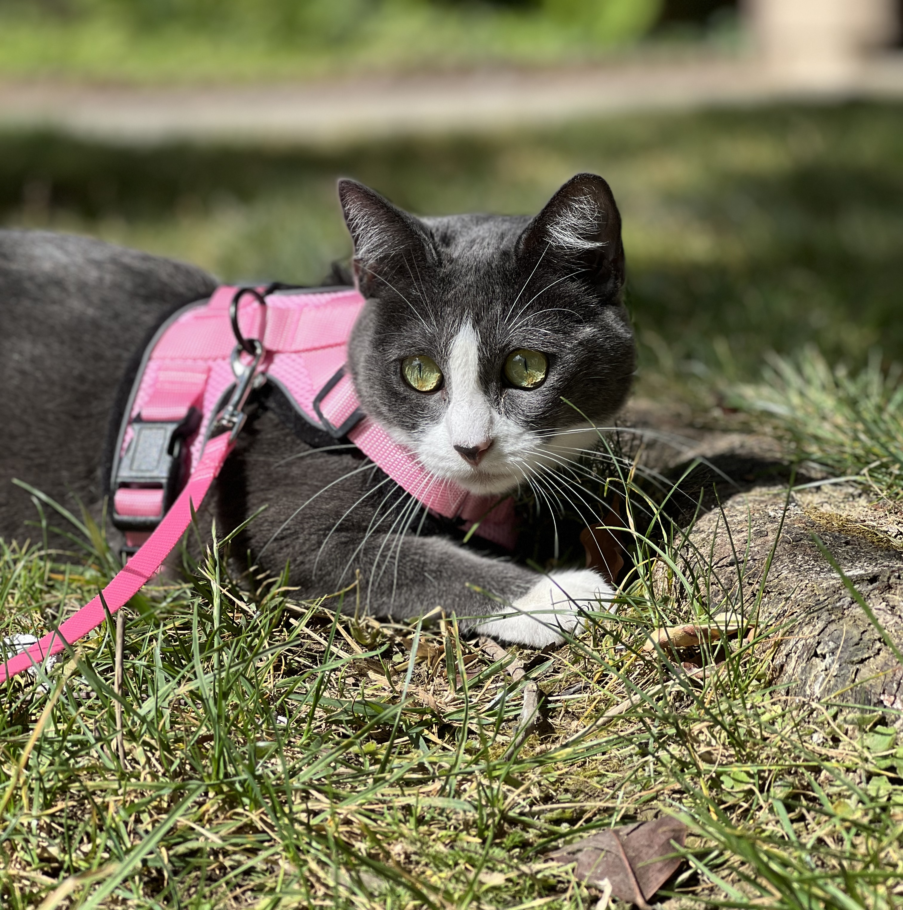
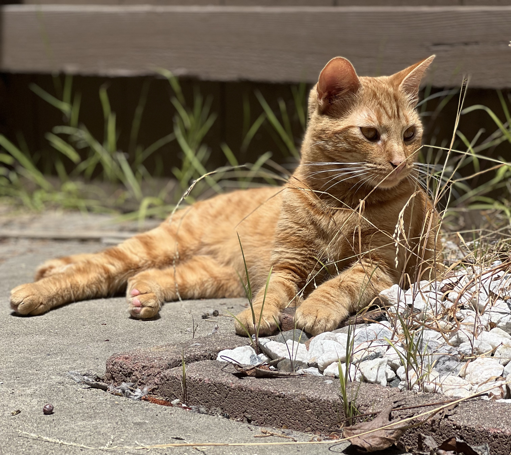
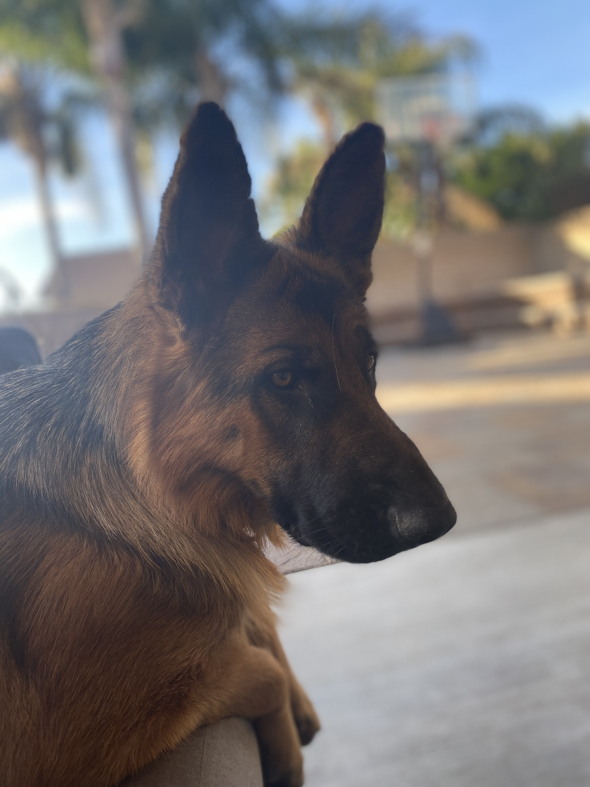
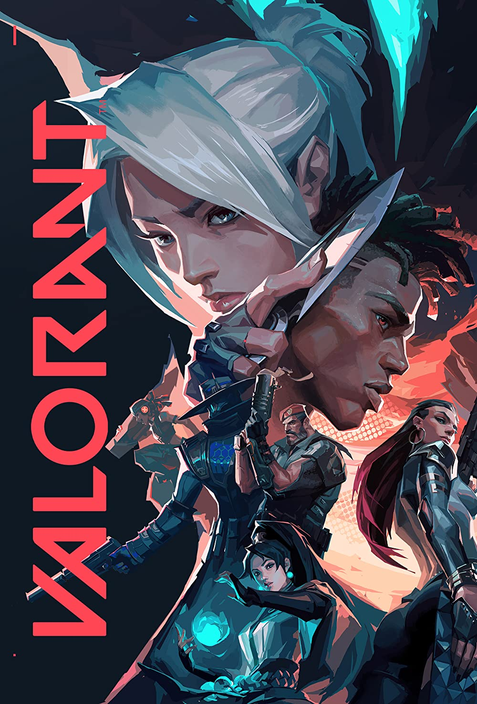
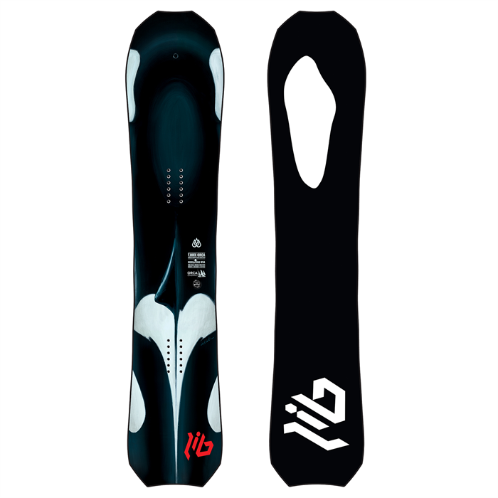

# Leo's User Page

### ***Table of Contents***

- [x] [Introduction](#Introduction)
<br/>
- [x] [Experience](#experience)
<br/>
- [x] [Pets](#pets)
<br/>
- [x] [Hobbies](#hobbies)


<br/>

###  ***Introduction***
<br/>

Hello! My name's Leo and I am currently a fourth year majoring in Math-Computer Science. A year ago I was studying Nanoengineering as I had transferred from UCR where I was studying Material Science and Engineering. I only recently discovered my passion for computer science but have been looking for experience anywhere I can get it! I am also a big overthinker so I like to live by the quote:

> "Don't think just do!"

<br/>

[Click on this to find out my favorite coding language!](README.md)

<br/>

### ***Experience***
<br/>  
While I do not have a lot of out of class experience, a friend and I created a partially unfinished app, called Netflix and Chill, where you would be able to swipe on movie selections and match with others based on movie preferences. Below is a part of our set up code:

```
  <Stack.Screen
    name="Welcome"
    component={Welcome}
    options={{ title: 'Welcome', headerShown: false, }}
  />
  <Stack.Screen
    name="Main"
    component={MainScreen}
    options={{ headerShown: false, }}
  />
```
<br/>

[Here is the link to the repository](https://github.com/niaignacio/nileo)

<br/>

### ***Pets***
<br/>
I have three pets, 2 cats and a dog. My 2 cats are in San Diego with me while my dog is back home in Diamond Bar where I'm from. Their names are :

    - meow meow  (grey tuxedo cat)
    - shinki binkers (orange tabby cat)
    - boogley (german shepherd)





<br/>

My friends and I love cats and together we have 10 total cats! Two of them are new kittens so they aren't name yet. For the others, their names are:

    1. Meow Meow
    2. Shinki
    3. Zy
    4. Zumi
    5. Noki
    6. Indi 
    7. Tiva
    8. Ori


<br/>

### ***Hobbies***
<br/>

Valorant is currently my most time consuming hobbie that I currently indulge in. I've always loved video games and would love to work in the gaming industry one day.



<br/>

Another hobby of mine is snowboarding. I have been more busy with academics and job searching that I haven't had the time to this year. I hope to pick up the sport again next season! My snowboard is called the T.Rice Orca because orcas are my favorite animal




